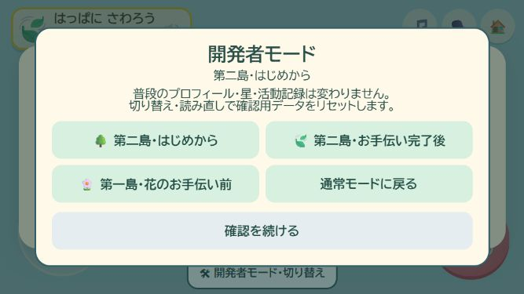
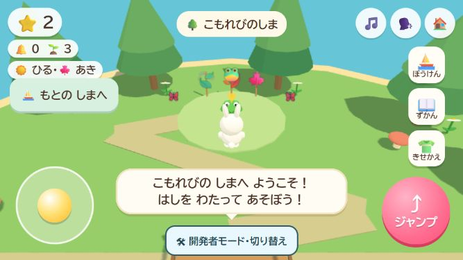
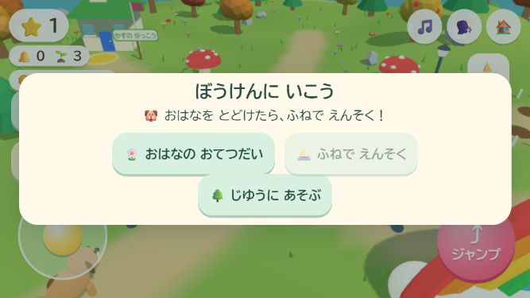

# 島をすぐ確認する開発者モード

## 目的と使い方

第二島へ行く前提のお手伝いやキャラ作成を繰り返さず、確認したい場面をすぐ開く。2026-10-07の本人の実装依頼に対応。今回は作業ブランチで実装し、公開は行わない。

通常のタイトル画面で「おうちの方へ」→「開発者モード」→「第二島をすぐ確認する」を選ぶ。開いた画面の「第二島を確認する」を押すと、音を有効にして第二島へ移動する。URLの `?dev=forest` から直接開いてもよい。

確認中は下部に「開発者モード・切り替え」を常時表示する。場面を切り替えたり、通常モードへ戻ったりできる。

| 指定 | 開始状態 |
| --- | --- |
| `?dev=forest` | 花の配送済み、葉っぱは未収集、星１個。第二島の入口から森のお手伝いを試す |
| `?dev=forest-done` | 花と森の配送済み、星２個。飾り付け済みの広場の前から始める |
| `?dev=island` | 花の配送前、星０個。第一島のお散歩から始める |

いずれも確認専用のうさぎを用意し、最初のひよこの案内はお散歩状態にする。未実装の島への入口は追加しない。

## 記録の扱い

開発者モードはメモリー上だけのプロフィールを使用する。通常の端末保存と保存ロックには接続せず、実際の子どもの名前・星・衣装・活動記録を読み書きしない。確認中の収集や星はその画面内で試せるが、場面の切り替え・再読み込みで初期状態へ戻る。通常モードの複数タブの保存保護とプロフィール選択は従来のまま。

３つの有効な指定だけを受け付け、不明な値や重複した `dev` 指定は通常モードで扱う。終了は同じURLから `dev` だけを外す。開発者メニューを開いている間はゲーム進行・活動時間を止め、閉じた時も既存の休憩や案内の停止を尊重する。

## 実装と検証

作業場所: `C:/Users/futsa/Documents/Codex/2026-10-03/codex-ichi-game-futsalife24-bot-ichi/work/Ichi-game`。
GitHub: https://github.com/futsalife24-bot/Ichi-game 。ブランチは `codex/developer-island-preview`、基点は `abf94a1c1026a4bc608912ea9b9fca540abb7c0f`。実モデルID・推論設定は取得不可で未確認。サブエージェントなし。

- `src/developer-mode.js`: 起動時の保存先分離と３つの確認状態、URL切り替え。
- `src/main.js`・`index.html`・`style.css`: 入口、確認中表示、切り替えメニュー、第二島への移動。
- `sw.js`: 新しいモジュールをオフライン用一覧へ追加し、版を `kirakira-v29-developer-mode` へ更新。
- `tools/developer-mode.test.mjs`: 通常保存とロックに触れないこと、３場面の有効性、開き直しと別画面の分離、既存プロフィールと未知項目の保持、通常のロック失敗、URLの扱い、メニュー中の停止を検証。
- 既存の実接続テスト２ファイルは開発者メニューを閉じた通常状態を模擬環境へ追加。保存失敗・休憩の既存検証は維持。CIには追加テストを組み込む。

自動テスト119件成功、音声708個の完全性確認成功。構文確認・差分の空白確認成功。実装は `34a3dabfafe167e2bfb4ed87432cb0c09570703e` に保存し、[GitHubの必須チェック](https://github.com/futsalife24-bot/Ichi-game/actions/runs/37579243383) も成功。追加の音声生成なし。ローカル配信の画面と新モジュールはHTTP 200。

UI018のChromeで844×390と667×375を実操作した。キャラ作成と花の配送を飛ばして第二島へ入り、葉っぱ１枚を収集できた。再読み込み後は未収集の開始状態へ戻る。完了後の場面は星２個と飾り付け済みの広場の前、第一島は星０個から始まる。

開発者モードだけを試した時点では通常プロフィールは作られなかった。続けて通常モードに架空プロフィール「通常モード確認」を作り、ひよこの活動で星１個を獲得。通常画面を開いたまま別タブで開発者モードの完成済み第二島へ入れた。通常の保護者画面の入口も使い、通常モードへ戻るとプロフィール・星１個・花の未完了・船の未解放を保持していた。警告・エラー０件。詳しい結果は [確認記録](developer-mode-check.json)。

画面サイズを元に戻し、確認タブを閉じて `UI-20261007-018 UI解放済み` を報告。実画面で追加修正は不要だった。公開は未実施。実スマホと人による音声の聴感は今回の確認対象外。

