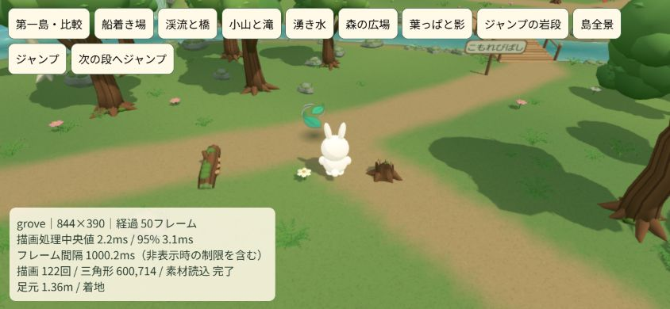
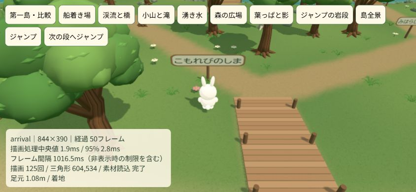
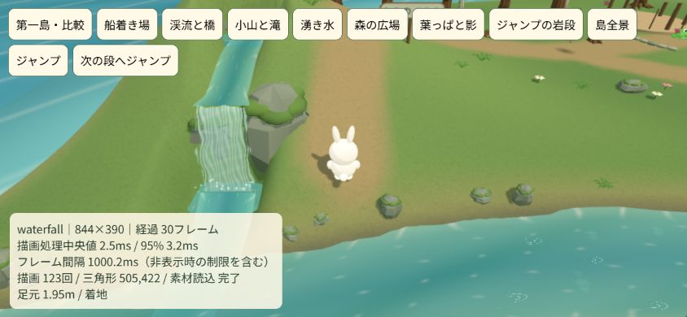
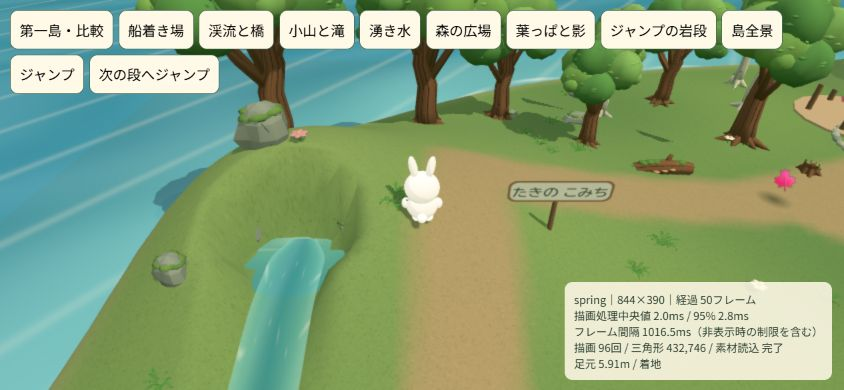
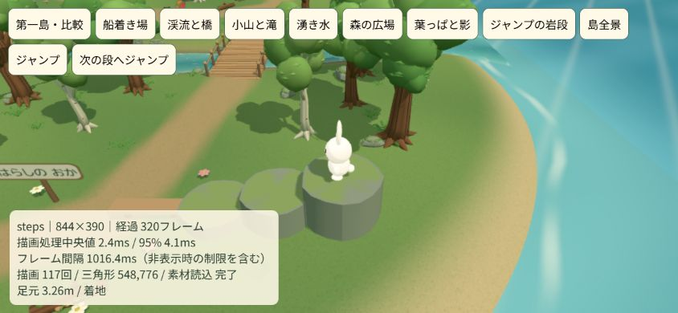

# 第二島の遠近感・看板・水源とジャンプ段差

2026-10-07。本人の画像３枚による指摘を受けた修正。新しい公開指示はなく、この版は未公開。

ブランチ `codex/forest-depth-and-spring`、基点 `9dd689824712d6f0c56af9febddb25117366fc6c`。公開mainは `26e421cc35367be678d83702f8dda6cabce808f5`。作業場所は `C:/Users/futsa/Documents/Codex/2026-10-03/codex-ichi-game-futsalife24-bot-ichi/work/Ichi-game`、GitHubは https://github.com/futsalife24-bot/Ichi-game 。今回は単独で実施。実モデルID・推論設定は取得不可で未確認、切り替えなし。

## 修正内容

- 葉っぱ：柔らかい接地影を追加。影の頂点を地面の傾斜に合わせ、葉が上下しても真下の位置を示す。収集時・活動完了時は葉と同時に消える。
- 看板：第二島４枚の支柱を板の下端までに短縮して背面へ寄せる。表示面を前へ出し、透明部分を正しく扱って黒い四隅も除去。第一島の建物看板も支柱を板より下で止める。
- 滝：背後に小山を造成。岩間の湧き水の池（高さ5m）から、斜面の流路、滝の口（約4.13m）、滝つぼ、本流まで水面を連続させた。水路の底を同じ関数で掘り、木・シダ・花が流路に重ならないようにする。
- 立体的な寄り道：見晴らしの丘の脇に３段の苔岩を追加。高さは基準地面から0.75m・1.45m・2.15m。横移動だけでは段差を通れず、ジャンプで足が上面に届くと乗れる。端から降りると落下して着地する。通常の葉集めは平坦な道と橋で続けられる。
- 案内：池の丸い岸を避け、岩段の上からは先に横の空いた地面へ降りる。保存形式・報酬・音声は変更しない。

## 検証と修正

134テスト成功。追加した４件で、傾斜に沿う影と非表示の同期、看板の文字面を支柱が遮らないこと、水面と水路の連続、実Playerで歩行を止めて３段をジャンプで登り降りすることを確認した。既存の全有効格子点から葉・カエル・船着き場への経路、両橋の往復、葉３枚を届けて報酬を保存する検証も成功。実画面の調整後、岩段の通常カメラに樹冠が入らない回帰も追加し、関連12テストが成功。

最初は池周囲を四角く広く閉じたため、西岸から戻る道がなくなることを回帰テストで発見。池の丸い岸と細い流路に合わせた境界へ修正して解消した。段差の経路判定は対象範囲外を早く除外し、余分な配列生成をなくした。実画面では水路に花が重なったため、配置対象から水源と流路を除外した。岩段の手前に樹冠が重なる問題も実画面で発見し、通常カメラとの間を空けた。岩の輪郭を不均一にして、足元を見ながら登れる状態へ修正。

Chrome・844×390の比較画面で、葉の影、看板、小山・池・滝の流路、岩段を確認。実ゲームのForestとPlayerを使用し、通常のジャンプ入力と横移動を確認用ボタンから渡して３段へ着地した。足元の表示は1.86m→2.56m→3.26m。これは各段の基準地面からの上乗せではなく、ワールド座標の高さ。通常のゲーム内へ検証用ボタンは追加していない。比較用画面は `http://127.0.0.1:5196/tools/forest-review.html`。

この操作環境は描画間隔が約1000msに制限され、通常のFPSや実スマホの速度は判定できない。通常プロフィールは開いていない。素材の原本は既存Blender素材を再利用し、今回の地形・影・岩足場はゲーム内形状として実装した。

警告・エラー０。画面サイズを復元して確認タブを閉じた。[画面確認の証拠](forest-depth-check.json)に三段の表示値と制約を保存。調整運用は本人指定で終了・全UI解放済みだったため、今回の直接依頼として単独で確認し、旧UI036は再使用していない。制作・必要な自己検証は完了。公開はこの完成版への新しい指示を受ける。

## 変更ファイル

`src/forest-layout.js` は小山・水路・段差の地形と歩行・案内。`src/forest-water.js` は池と上流の描画。`src/forest.js` は葉の影・看板・岩足場・植生配置。`src/world.js` は第一島の看板支柱。`sw.js` は未公開の次版 `kirakira-v31-forest-depth`。`tools/forest-layout.test.mjs` と `tools/forest-review.html` は回帰検証と実画面の確認。
