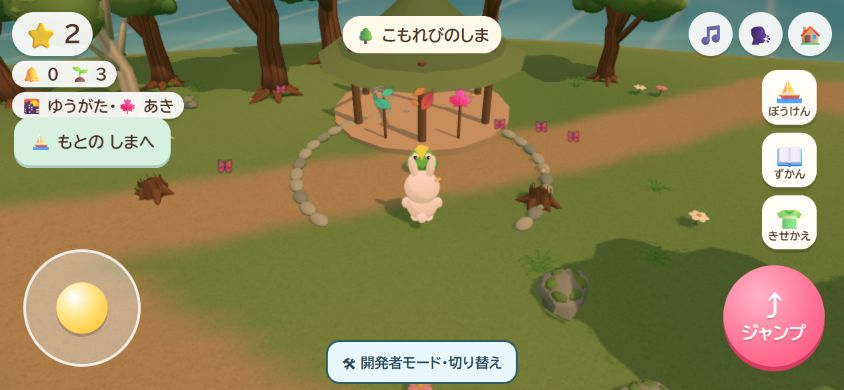
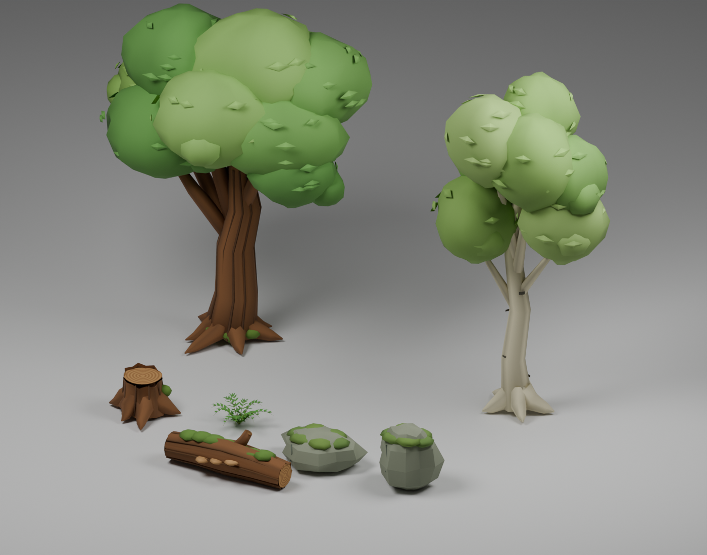
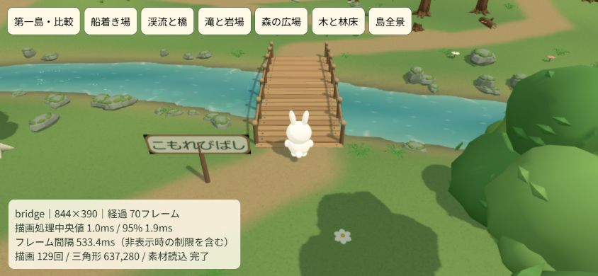
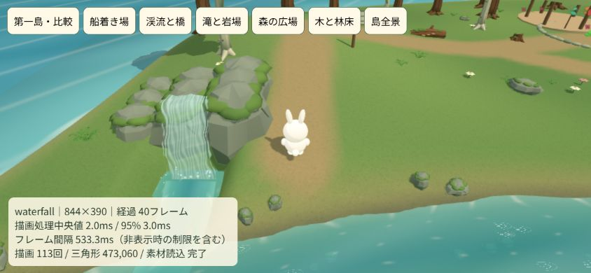
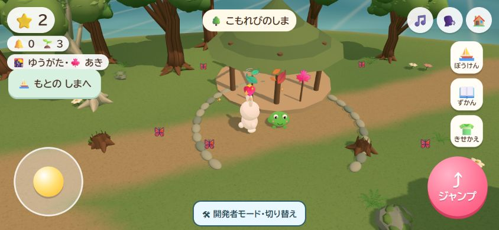
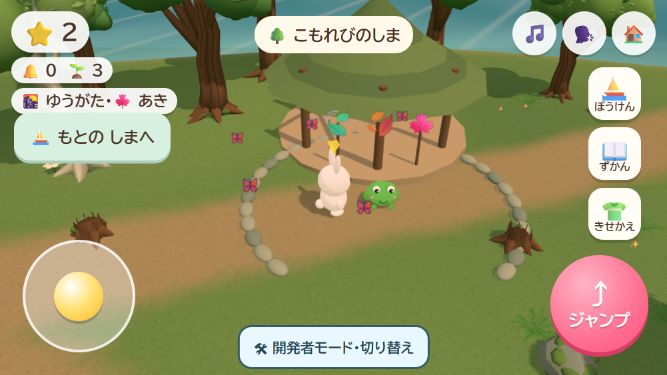

# 第二島の作り込みをやり直す

## 公開完了（2026-10-07）

制作後、本人の「第二島公開して」を調整チャットで直接確認。[PR28](https://github.com/futsalife24-bot/Ichi-game/pull/28)でmainへ反映した。承認版 `1057564501eae54fe632423090dc0ee139027987` のゲームは変更せず、公開準備で見つけたPagesの素材コピー漏れだけ修正（`5cd5eac4c1ae6cb9c49d54733d40451f6764089d`）。配信準備764ファイルを音声708個込みで原本照合、対象HEADのGitHubチェック２件成功。公開mainは `26e421cc35367be678d83702f8dda6cabce808f5`。

[main必須チェック](https://github.com/futsalife24-bot/Ichi-game/actions/runs/37592441140)・[Pages公開](https://github.com/futsalife24-bot/Ichi-game/actions/runs/37592441190)成功。公開先56資材と開発者モードの３入口が原本と一致。UI036のChromeで素材読込、川の遠景、案内による移動、完成した広場、星２個を保持して帰島を確認した。警告・エラー０。UI032の一周・小さい横画面・滝の検証は再利用。実スマホ速度は未確認。[公開照合の詳細](second-island-craft-release-check.json)へ保存し、画面サイズを戻してタブを閉じ、UI036返却済み。[公開版の第二島](https://futsalife24-bot.github.io/Ichi-game/?dev=forest)で確認できる。以下の「未公開」は制作段階の履歴。

2026-10-07。本人が「第一島を遊び込んだ先の島として、最低限第一島と同等、理想は流れる水と木・地面の質感を仕上げる」と指示。サブエージェントを使うこと、ネットで制作資料を調べること、Blenderで細部を作ることも明示された。公開指示はこの改修にはまだない。

作業場所は `C:/Users/futsa/Documents/Codex/2026-10-03/codex-ichi-game-futsalife24-bot-ichi/work/Ichi-game`。GitHubは https://github.com/futsalife24-bot/Ichi-game 。ブランチは `codex/second-island-craft`、基点は `37ddb2b1d7a8a68f8c314a7d94dfe758bd832fc6`。公開mainは `536f1fd2af28deea9958a0f885b3fcf1761bf771` のまま。実モデルID・推論設定は取得不可で未確認。資料/数値レビュー、Blender素材、水表現/検証を３サブエージェントへ分担した。

## 問題と到達基準

旧第二島の歩行半径17.5は第一島の34に対し面積約26.5%。平らな円盤、直線で静止した水、円錐の木12本だった。動作確認の合格だけで、次の島としての視覚的な完成を判定してしまった。

新しい島は半径46を基本に自然な海岸を持たせ、二つの丘、蛇行する渓流、二つの木橋、滝、林間の広場とあずまや、海へ伸びる桟橋を配置する。通常の進行条件・星の報酬・保存形式は維持。３枚の葉の座標を広い道へ置き直す。旧記録は葉の番号で保持される。

- 水は川底を見せ、深浅の色、流向を持つ光、岸の泡、岩の後流、落水と飛沫を動かす。Three.jsの通常の照明・影・霧を保つ。
- 木はBlenderで曲がる幹、枝、根、樹皮の溝、個別葉を含む樹冠を作る。シダ、苔岩、年輪の切り株、苔とキノコのある倒木もゲームへ入れる。
- 草・土の道・湿った岸・砂浜を地形上で混ぜ、細かな表面模様と凹凸を加える。川岸・橋の描画と歩行判定は同じ地形関数を使う。
- メッシュの共用・インスタンス化と固定建造物の結合で描画回数を抑える。道と収集点を手前の樹冠で隠さない。

## 資料と原本

[自然表現の資料](second-island-art-references.md) にNPS、US Forest Service、Poly Havenの出典・観察点・利用条件を記載。写真や外部モデルの流用はなく、自作形状と手続き模様へ反映した。

[Blender制作記録](../assets-src/forest/README.md) に原本・再現方法・寸法・面数を記載。素材全７種は合計12,490三角形、ゲーム用JSON約0.9MB。GLBと編集可能な `.blend` も保存している。

## 検証と改善の経緯

1. 第一島のコードと比較し、規模と地形・植生・水面の不足を定量化した。
2. 新しい地形・水・素材を統合。サブ担当の数値レビューで水面と岸の隙間、橋端の段差、桟橋と足元のずれ、船の砂浜への乗り上げを発見し修正。
3. 素材ロード後の実Player移動で葉３枚と配送完了へ到達。斜面での根や石の浮きを減らすため８方向の地面を調べて支持高さを下げ、道のカメラ側の樹冠を避ける配置に変更。
4. 蛇行川の任意の出発点から案内すると川へ突き当たる問題を発見。安全な格子経路で既存の道を優先し、短縮区間も検証する方式へ修正。1,565経路を0.1m間隔で確認し、回帰４件成功。準備中に経路を構築し、最初の案内での待ちを避けた。
5. `tools/forest-review.html` に第一島との同条件比較と、船着き場・川・滝・広場・林床・全景の確認画面を用意。実ブラウザーでの視覚と負荷、実ゲームの一周を確認するまでは完成としない。

自動検証は130件すべて成功、音声708個の完全性確認とBlender素材７種の実ファイル検査も成功。主要な道153地点の通常カメラから主人公へのレイ確認で、木の遮りは37地点から０へ改善。葉３地点・船着き場・桟橋端・カエル・両橋入口も遮り０。木は47本、シダ121群。Blender素材の配置後三角形は589,700から400,416へ減らした。これは全配置の潜在量で、画面に実際に描かれる三角形やフレーム時間ではない。

上の本数・面数・遮り検査は最初の統合段階の値。その後の実画面確認で次も改善した。

6. 第一島と同じ照明・カメラで比較。新しい森の描画回数と面数が多かったため、Blender素材を16m区画へ分けて画面外を省略し、花と固定物を結合した。船着き場の同じ844×390画面で303回・1,031,778三角形から133回・623,890三角形へ減少。
7. 滝の手前に見晴らしのある道を置き、岩棚をBlenderの苔岩へ差し替え。落水の縁を不均一にして、太い縞を細く弱め、源流の短い岩棚と飛沫をつないだ。主要な描画調整後、地形・経路・冒険の関連20テスト成功。最後の落水模様調整は構文検査と実ブラウザーで描画確認。

## 実ブラウザーでの確認

`UI-20261007-032` のChromeで、比較画面の第一島・船着き場・橋・滝・広場・全景を確認。実ゲームでも第二島へ入り、葉３枚を案内に沿って収集、橋を渡り、カエルへ配送。広場が飾られ、初回の星１個を得て合計２個になった。自由に遊ぶ画面と第一島への帰還後も星２個を確認。844×390と小さい667×375で主人公と操作部が画面内に収まり、警告・エラーは両タブとも０件。比較画面は昼、実ゲームは夕方の外光。実ゲーム一周後の落水模様の最終調整は比較画面で検証した。

画面サイズを戻して両タブを閉じ、UI032を返却済み。公開はしていない。[検証の生データ](second-island-craft-check.json) に手順・計測・ログ・制限を保存した。

| 場所（844×390） | 描画呼出 | 三角形 | 呼出CPU中央値 / 95%点 |
| --- | ---: | ---: | ---: |
| 第一島・比較 | 261 | 215,666 | 3.7 / 4.9ms |
| 第二島・船着き場 | 133 | 623,890 | 2.3 / 4.0ms |
| 第二島・橋 | 129 | 637,280 | 1.0 / 1.9ms |
| 第二島・滝（最終） | 113 | 473,060 | 2.0 / 3.0ms |
| 第二島・広場 | 135 | 469,186 | 1.7 / 2.4ms |

描画呼出のCPU時間はGPUの完了時間ではない。この操作環境では両島ともフレーム間隔が約533msに制限されており、通常のFPSや実スマホの速度は判定していない。第二島の画面内三角形は第一島より多く、端末上の速度確認は残る。見た目の好みの承認も、テスト成功から推定しない。

## 変更範囲と次の行動

- `src/forest-layout.js`、`src/forest.js`、`src/forest-water.js`：地形、歩行、経路、植生、建造物、水の描写。
- `src/adventure-state.js`、`src/main.js`：新しい収集点、船の位置、素材の読込と入島処理。
- `assets-src/forest/`、`assets/forest/`、`tools/build-forest-assets.py`：Blender原本、再現手順、ゲーム用素材と検査。
- `sw.js`、`.github/workflows/voice-check.yml`、関連テスト：素材の配信準備と回帰検証。
- `tools/forest-review.html`、`tools/serve.mjs`、本記録・画像：同条件比較、独立ポート、検証証拠。

基点とブランチは冒頭のとおり。第一段階の実装保存は `7861f776b710a246af0acc3c9e72c022bad8bad0`、最終調整はその後の同ブランチへ保存する。main統合・公開は本人の明示指示を受ける。必要な実端末確認以外、成功済みテストや素材生成を繰り返す必要はない。
