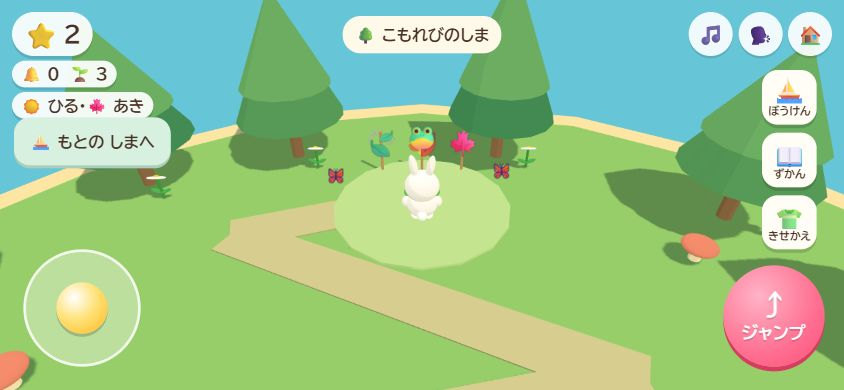
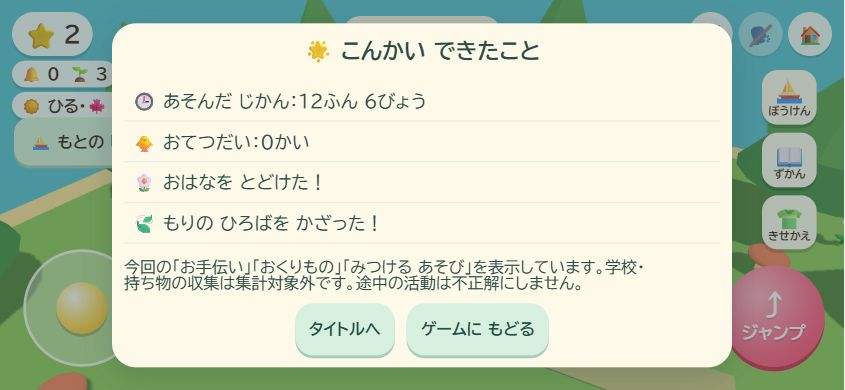

# 花のお手伝いと第二島

## 今回の到達点

第一島でいぬに花を届け、家の前に花を残す。そのあと船で第二島「こもれびのしま」へ行き、小川の橋を渡って葉っぱを集め、森の広場を飾るところまで遊べる版を作る。

ユーザーの自走指示を受けた初版の判断として、花のお手伝いの完了で船の案内を開く。年齢、星の数、正解率を条件にしない。お手伝いの途中でも自由遊びへ戻れ、集めた分は保存する。第二島から第一島へいつでも帰れる。再読み込みは第一島から始まり、第二島の途中の分と完成した飾りを復元する。

既存の学校、おうち、住民、図鑑、衣装、プロフィール、ひよこのお手伝いは保持する。新しい活動は学習の正誤や発達の評価に混ぜない。報酬は各活動の初回完了に星を１つ、完了と同じ保存で確定する。

## 受け入れ条件

- 花３本を集めて届ける。家の前の花が再読み込み後も残る。
- 船の案内から第二島へ行き、橋を渡り、葉っぱ３枚を森の広場へ届ける。完成した葉っぱの飾りが残る。
- 「いっしょに さがす」で移動の手助けができ、途中から続けられる。
- 帰島、タイトルへ戻る、時間の休憩、衣装画面、再読み込み、別プロフィールでも操作と記録が混線しない。
- 保存失敗で進行や星を先取りせず、古いデータと未知の版を守る。
- 横画面の実ブラウザーで一周し、小さい横画面でも案内と操作が重ならない。
- 新しい案内に必要な音声を追加し、出荷済みの音声原本を保持する。

## PDCA

### 計画

先に花のお手伝いを実装して一周を確認する。そこで見つけた問題を直し、第二島の風景、船、探索、保存を追加する。各段階で実プレイと保存の反例を確認して記録する。

### 実装・確認・改善

2026-10-05、Chromeの隔離したローカル保存先で、架空の子「ぼうけん確認」を使って実施。

- 花３本を案内ボタンで歩いて収集。２本の時点で再読み込みし、２本を維持して残り１本と配送を完了。船の案内が開き、星１個を確認。
- 第二島へ行き、葉っぱ３枚を案内ボタンで収集。小川は橋を通って渡り、かえるへ配送。星は合計２個、広場の飾りを確認。
- 844×390、667×375の横画面を確認。案内、帰島、ジャンプが重ならず押せる。第二島でも背景と外の照明を使った着せ替えを開ける。
- 再読み込み後に第二島へ再訪し、完了表示と星２個を維持。再訪だけで星を増やさず、第一島へ帰れる。
- 実プレイを受け、橋を通る経路、手動移動時の経路解除、帰島直後に船の案内を連続表示しない制御、島名の表示を追加。
- 自己レビューで、第二島へ第一島の収集処理を流さないこと、案内画面中の休憩から戻っても移動を有効にしないことを修正。
- 振り返りに今回完了した花・森の贈り物を追加。学習の正誤や発達の記録とは混ぜず、旧セッションで過去の贈り物を数え直さない。
- 最終のゲーム側チェックは104件成功、差分の空白チェックと構文確認も成功。Chromeで警告・エラー０件。既存音声698個を取り込み記録のハッシュと照合し、差異０件。
- 追加の架空プロフィール「途中確認」で声を切り、葉っぱ１枚の時点で帰島・再読み込み。子の選択後に第二島へ戻ると「つづきから あそぶ」が表示され、取得済み１枚と声なし設定を維持。残り２枚を集めて配送すると星は合計２個。第二島からホームを開いた振り返りに、今回の花と森の贈り物の両方を表示した。追加のコード修正は不要だった。

架空プロフィールの再訪後の画面。完成した広場と星２個を維持し、島名・帰島・着せ替えの入口を表示。

別の架空プロフィールで葉っぱ１枚から再開して完成。第二島からホームを開くと、花と森の今回の贈り物を表示する。

### 音声の現在地

2026-10-05、同じ送信承認待ちが３ターン継続した。途中再開の追加プレイテストを含む独立した必須作業は完了し、残る音声生成には具体的な送信承認が必要なため、goalを `blocked` へ更新した。完了にはしていない。現在の音声一覧も698個のまま、追加の未収録は10個、27番の生成原本は存在しない。承認後にgoalを再開し、生成・取り込み・必要なチェック・ゲーム内確認へ進む。

追加台本は10クリップ、`batch-27.txt`。出荷済み698クリップと `voice/index.json` を保持している。Google AI Studioへの台本入力を自動承認レビューが拒否したため、具体的な台本と送信先の確認をユーザーへ出している。新規契約・キー作成・支払い設定変更は行っていない。

音声の生成・取り込みが済むまで `pendingLines()` を残す。現時点の `tools/voice.test.mjs` の収録完了確認と `tools/finalize-voice.mjs --check` は未完了として失敗する。公開用チェックを外したり、未収録を収録済みにしたりしない。ゲーム本体の確認を音声の完了と取り違えない。

取り込み後はサービスワーカーの版も更新する。確認用の保存先には音声追加前の `kirakira-v27-second-island` が導入されているため、同じ版を使い続けて古い音声一覧が残らないようにする。

## 作業の記録

- 開始時点: `codex/help-picnic-release-record` / `0188f8334cb5b111682873453305ec7ef91294c3`。未コミットなし。
- 作業ブランチ: `codex/flower-and-second-island`。
- 公開版の基点: `1a8f6f90d5af7ee52a5c0a836cb139cd8f6dae92`。
- 公開と `main` 統合は完成版への明示承認を別途受ける。
- 実モデルID・推論設定: 取得できず未確認。設定変更なし。
- 実装保存版: `d5b318c49451595b16b9b80ef79bd5d471ff6acf`、GitHubへのpush成功。
- [保存版の自動チェック](https://github.com/futsalife24-bot/Ichi-game/actions/runs/37314226031) は、追加音声が `pendingLines()` に残るため収録完了テストで失敗。新機能の９テストとそれ以外のゲーム側チェックは成功。公開用の音声条件は維持している。
- [記録追記版の自動チェック](https://github.com/futsalife24-bot/Ichi-game/actions/runs/37314645793) も同じ収録完了１件のみ失敗。対象HEADは `3e155b2fa11d39709dbc9a47062a76cf478864ef`。音声の送信承認はまだ得ていない。
